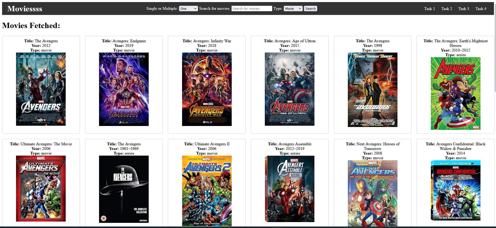
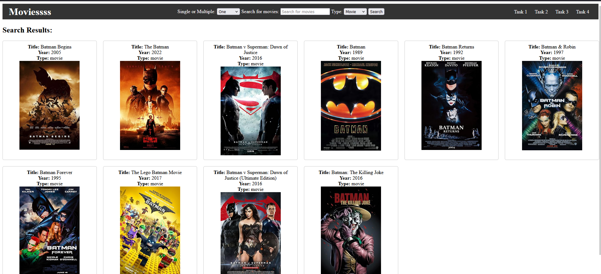
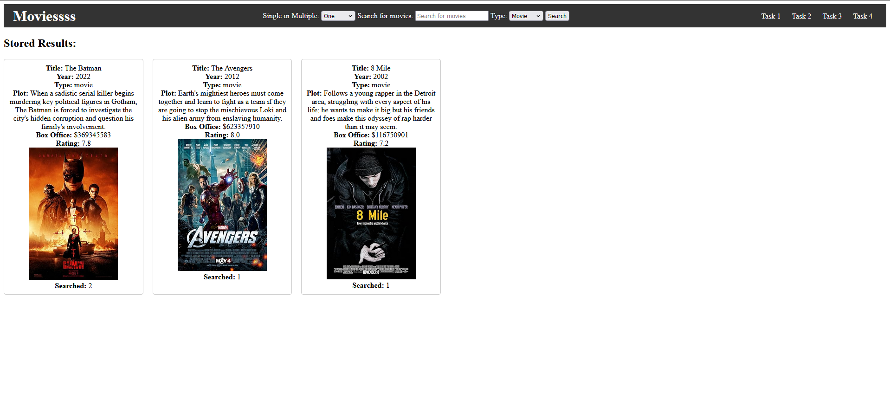

# UC_InterviewTasks_24
 
# 🎬 DJ Unicode Tasks - Movies Website 🎥

Task Link - [Google Drive Link](https://drive.google.com/file/d/1_olbHxt4P4TsrTQE8QznGJk-wvgnka-d/view?usp=sharing)

Welcome to the DJ Unicode Interview Tasks 2024! This project allows you to search for movies, store them in a database, and compare them based on various criteria. You can choose any two movies and see which one comes out on top!

## 🚀 Features

- **Search Movies**: Search for movies by title and type (movie, series, episode). The app fetches data from the OMDB API.
- **Store Movies**: Save movie details such as title, year, plot, type, poster, box office collection, and rating in a database.
- **Compare Movies**: Choose two movies and compare them based on rating, search popularity, genre, and box office collection.
- **View Results**: See the comparison results and determine the winner!

## 🔧 Setup

1. **Clone the Repository**:
    ```bash
    git clone https://github.com/MonilMehta/UC_InterviewTasks_24.git
    cd UC_InterviewTasks_24
    ```

2. **Create and Activate a Virtual Environment**:
    ```bash
    python -m venv venv
    source venv/bin/activate  # On Windows, use `venv\Scripts\activate`
    ```

3. **Install Dependencies**:
    ```bash
    pip install -r requirements.txt
    ```

4. **Configure Environment Variables**:
    - Make a `.env` file in root directory.
    - Add your OMDB API key to a `.env` file in the root directory:
      ```env
      OMDB_API_KEY=your_api_key_here
      ```

6. **Run Migrations**:
    ```bash
    python manage.py migrate
    python manage.py migrate
    ```

7. **Start the Development Server**:
    ```bash
    python manage.py runserver
    ```

8. **Open the App**:
    - Navigate to `http://127.0.0.1:8000` in your web browser.

## 🎨 Screenshots
- **Home Page**: 
- **Search Page**: 
- **Database Page**: 
- **Comparison Page**: 

## 📚 Usage

1. **Search Movies**: Use the search form to find movies by title and type.
2. **Store Movies**: The searched movies will be saved in the database automatically.
3. **Compare Movies**: Go to the comparison page to select and compare any two movies based on rating, popularity, and box office.

## 📝 License

This project is licensed under the MIT License - see the [LICENSE](LICENSE) file for details.

## 🤝 Contributing

Contributions are welcome! Please open an issue or submit a pull request if you have any improvements or bug fixes.

## 💬 Contact

For any questions or feedback, please reach out to [your.email@example.com](mailto:monilmehta5@example.com).

---

Happy Coding! 🎉
